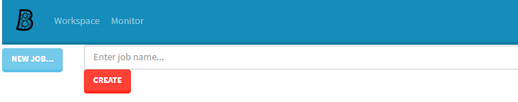
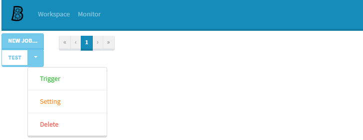

# Bubble

[](https://travis-ci.com/muguangyi/bubble) [](https://codecov.io/gh/muguangyi/bubble)

> An Asymmetric Continuous Integration Framework.

## Background

If any CI machine could run any type of job, there is a precondition: All machines must have the same environment, like softwares, etc. But for small team/company, it's hard to maintain so many machines with different CI requirement. Use `Unity` engine as an example, it will publish many versions per year, and different teams may use different version of Unity. Trying to setup CI cluster is really hard since every machine should install all possible versions of Unity. Another option is one machine only handle limited jobs to reduce the dependency of the environment, but the disadvantage is the physics resources can't be used fully and less flexable.

Bubble wants to setup more flexable solution. It could split a job to separated steps and execute them on different machine. Also every machine could have different environment, and Bubble could collect the ability of every different machine and decide where to execute.


### Features

* Job is splittable.
* Distribute job dynamically.
* Working node is self-descriptive.
* Buildin many actions: shell, zip, ftp, unity, email notification, etc.
* Support variable and methods.
* Job tracking, like duration.
* Monitor working nodes.

## Install

* Download target binary [release](https://github.com/muguangyi/bubble/releases).
* Uncompress to local folder.

## Quick Start

There are two type nodes: `Master` and `Worker`.

|Concept|Description|
|--:|:--|
|`Master`|The master node could parse and separate job to steps (Action), and distribute to working node.|
|`Worker`|The real working node that could handle action execution and sync the result to master.|

### Run master

* Navigate to master folder.
* Run master
  
  ```shell
  > bubble-master.exe
  ```

### Run worker

* Navigate to worker folder.
* Run worker

  ```shell
  > bubble-worker.exe
  ```

### Visit in Browser

Visit localhost in browser and show the following result. Congrats! Bubble is ready.



### First Job

* Input a job name, like Test.
* Press `CREATE`



### Run Job

* Press `Setting` to check the Bubble script.
  
  ```yml
  # .bubble.yml
  -
   action: shell
   script:
   - echo Hello Bubble!
  ```

* Press `Trigger` to execute the job.

## Documentation

Detail information please refer to [Wiki](https://github.com/muguangyi/bubble/wiki).

## Maintainer

[@MuGuangyi](https://github.com/muguangyi)

## License

[MIT](LICENSE) © MuGuangyi
