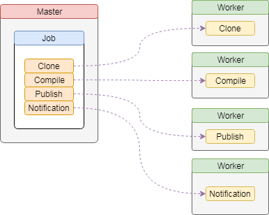

# Bubble

**非对称**CI/CD服务。

* 动态分配任务
* 节点具有自我描述性（管理中心了解节点能做什么）
* `shell`命令执行
* 打包（`compress`）
* 上传（`ftp`）
* unity编译
* 消息通知（邮件通知）
* 数据收集（执行时间等）
* 监控节点

## 方案

主流的`CI/CD`解决方案都是有一个预设前提，所有的版本机器环境一致，这样任务才可以动态分配。只是在现实使用中，尤其是游戏项目，其构建版本的需求往往不一致。例如，`iOS`版本只能在`Mac`机器上构建，`Android`版本在`Windows`上构建可能性价比更高，`.NET`项目可能目前只能在`Windows`机器上编译，等等。因此很多时候，构建版本所依赖的硬件，操作系统，编译环境都很难做到一致。

针对上述情况，可能的方案是将传统的`Job`进行更为细的粒度拆分，并分散到不同的物理机器上。也就是说传统的将一个完整`Job`交给一个目标物理机全部完成的方式不能满足现在的需求，需要将`Job`可以拆分的步骤分散到满足步骤的不同环境中执行。



### 消除命令的物理机依赖

有些命令在执行时会存在**理论上**的物理机依赖，例如编译需要针对本地的目录，而下载可能就需要将代码下载到同一台物理机上。

**Bubble**为了去掉命令对物理机的依赖设计了`流磁盘`（`Stream Disk`），这样可以在命令之间传递磁盘数据，从而不再对数据的位置产生依赖。例如下载和编译可以分布在不同的物理机上，而在编译前，**Bubble**会将下载命令的目标文件传递到编译命令所在的物理机，从而让编译可以顺利进行。

## 编译

### 依赖

|环境|描述|
|--:|:--|
|`Go`| >= v1.12.0 |
|`Node.js`| >= v10.14.1 |
|`Redis`| >= v5.0 |

### 服务编译及发布

#### Windows

```shell
> publish.bat
```

#### Linux

#### MacOS

会生成三个平台的服务器版本

```text
pub
 |-- linux/
 |     |-- master/
 |     |     |-- dist/
 |     |     |     |-- css/
 |     |     |     |-- icon/
 |     |     |     |-- js/
 |     |     |     |-- index.html
 |     |     |-- bubble-master
 |     |     |-- log.xml
 |     |     |-- master.toml
 |     |     |-- master.yml
 |     |-- worker/
 |     |     |-- bubble-worker
 |     |     |-- log.xml
 |     |     |-- worker.toml
 |     |     |-- worker.yml
 |
 |-- mac/
 |     |-- master/
 |     |     |-- dist/
 |     |     |     |-- css/
 |     |     |     |-- icon/
 |     |     |     |-- js/
 |     |     |     |-- index.html
 |     |     |-- bubble-master
 |     |     |-- log.xml
 |     |     |-- master.toml
 |     |     |-- master.yml
 |     |-- worker/
 |     |     |-- bubble-worker
 |     |     |-- log.xml
 |     |     |-- worker.toml
 |     |     |-- worker.yml
 |
 |-- windows/
 |     |-- master/
 |     |     |-- dist/
 |     |     |     |-- css/
 |     |     |     |-- icon/
 |     |     |     |-- js/
 |     |     |     |-- index.html
 |     |     |-- bubble-master.exe
 |     |     |-- log.xml
 |     |     |-- master.toml
 |     |     |-- master.yml
 |     |-- worker/
 |     |     |-- bubble-worker.exe
 |     |     |-- log.xml
 |     |     |-- worker.toml
 |     |     |-- worker.yml
```

> 根据物理机的系统以及要部署的模块复制相应平台版本即可。
